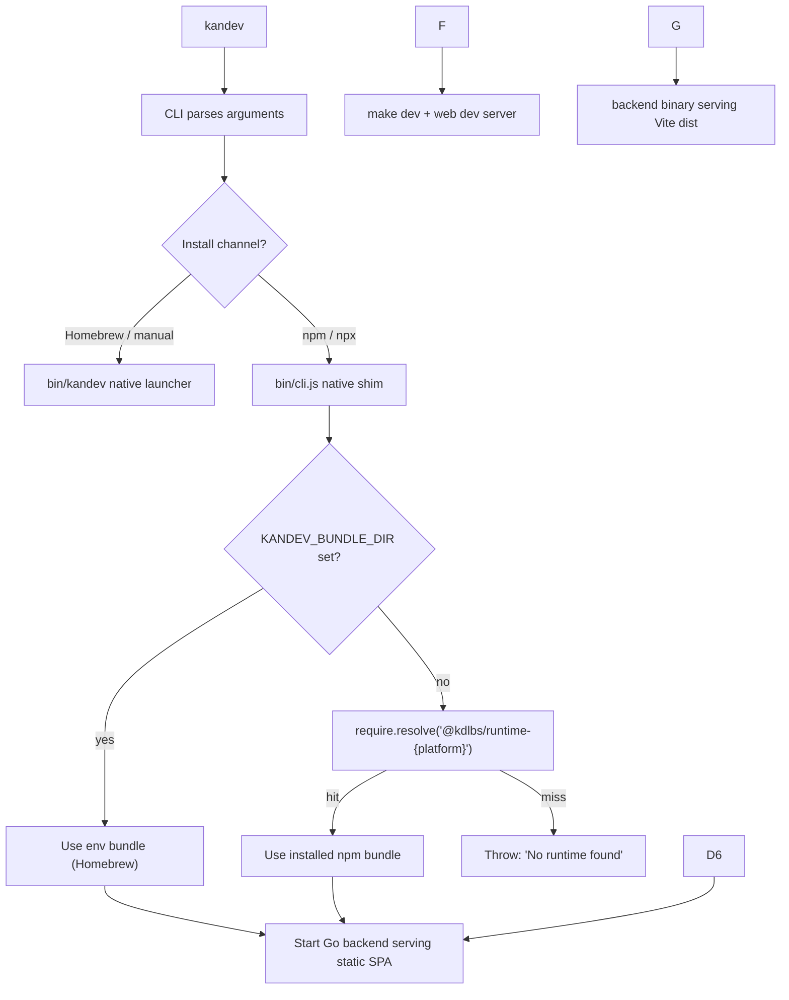

# Kandev CLI (internal docs)

## Architecture



## Overview

This package provides the `kandev` CLI launcher. The runtime bundle (Go backend, agentctl, and static Vite web assets) is **installed by the package manager** — there is no first-run download.

Two install channels share the same release artifacts:

- **npm/npx**: `kandev@X.Y.Z` declares `optionalDependencies` for `@kdlbs/runtime-{platform}@X.Y.Z`. npm 7+ filters by `os`/`cpu` and installs only the matching one.
- **Homebrew**: `kdlbs/homebrew-kandev` formula downloads the GitHub release tarball into the Cellar and installs `bin/kandev` as the public command.

Both channels resolve to a native runtime bundle. Homebrew/manual bundles contain `bin/kandev` and `bin/agentctl`; npm runtime packages also include the platform-matched binaries. The public command remains `kandev`; the hidden backend mode is `kandev __backend`.

## Artifact shapes

The GitHub release bundle and the npm runtime package are **different shapes** because they serve different consumers:

```
# GitHub release bundle (used by Homebrew + manual installs)
kandev/
└── bin/{kandev,agentctl,agentctl-linux-amd64}

# npm runtime package (@kdlbs/runtime-{platform})
@kdlbs/runtime-{platform}/
└── bin/{kandev,agentctl,agentctl-linux-amd64}

# Tauri desktop resource directory
apps/desktop/src-tauri/resources/kandev/
└── bin/{kandev[.exe],agentctl[.exe],agentctl-linux-amd64}
```

For npm installs, the main `kandev` package provides only a tiny Node bin shim that execs `bin/kandev` from the platform runtime package.
For desktop release builds, `scripts/release/prepare-desktop-runtime.sh` extracts the matching GitHub release bundle into the Tauri resource directory before `tauri build` runs.

## Commands

| Command                  | Description                                              |
| ------------------------ | -------------------------------------------------------- |
| `kandev` or `kandev run` | Run from installed runtime bundle (default)              |
| `kandev dev`             | Run local repo with hot-reload (requires repo checkout)  |
| `kandev start`           | Run local production build (requires `make build` first) |

## CLI Options

| Option                     | Description                                                |
| -------------------------- | ---------------------------------------------------------- |
| `--version`, `-V`          | Print CLI version and exit                                 |
| `--port`, `--backend-port` | Backend port                                               |
| `--web-internal-port`      | Override internal Vite dev web port                        |
| `--verbose`, `-v`          | Show info logs                                             |
| `--debug`                  | Show debug logs + agent message dumps                      |
| `--runtime-version <tag>`  | **Advanced/debug**: download a specific GitHub runtime tag |
| `--help`, `-h`             | Show help                                                  |

## Updates (package-manager owned)

The CLI no longer self-updates. Updates flow through the install channel:

```bash
brew upgrade kandev                  # Homebrew
npm install -g kandev@latest         # npm global
npx kandev@latest                    # always pulls latest
```

There is no `KANDEV_NO_UPDATE_PROMPT` or `KANDEV_SKIP_UPDATE` env var anymore — they're gone with the self-updater.

## npm shim

The npm package has no runtime dependencies beyond its platform optional runtime package. `bin/cli.js` resolves `KANDEV_BUNDLE_DIR` first, then the matching `@kdlbs/runtime-*` package, and execs the native `bin/kandev` binary with the original arguments.

```bash
pnpm -C apps/cli build      # syntax-checks the shim
pnpm -C apps/cli test       # tests runtime resolution
```

Smoke test the bundle in a clean directory:

```bash
KANDEV_BUNDLE_DIR=/path/to/dist/kandev node /path/to/apps/cli/bin/cli.js --help
```

If the runtime package or bundle is missing, the shim prints an actionable runtime-resolution error.

## Local Development

```bash
# Run CLI in dev mode (uses tsx)
pnpm -C apps/cli dev

# Run with arguments
pnpm -C apps/cli dev -- start
pnpm -C apps/cli dev -- --port 9000
```

## Release

Releases run entirely in GitHub Actions. From the GHA UI:

1. Open the **Release** workflow.
2. Click **Run workflow**.
3. Choose `bump` (patch / minor / major) from the dropdown.
4. Optionally tick `dry_run` to validate without publishing.
5. Click **Run workflow**.

The workflow does everything: version bump, CHANGELOG, PR, merge, tag, runtime bundles, desktop artifacts, npm publish, Homebrew tap update. See [/.github/workflows/release.yml](../../.github/workflows/release.yml).

Single SemVer flow: `apps/cli/package.json` version, git tag, npm packages, Homebrew formula, GitHub runtime tarballs, and desktop artifacts are all bumped to the same `X.Y.Z`.

Versioning:

- One SemVer `X.Y.Z` for everything (npm, GitHub tag, Homebrew formula)
- Git tag format: `vX.Y.Z`
- Legacy `vM.m` tags normalized to `M.m.0` during migration; new releases always use `vX.Y.Z`

## Environment Overrides

| Variable                              | Description                                                    |
| ------------------------------------- | -------------------------------------------------------------- |
| `KANDEV_BUNDLE_DIR`                   | Force runtime bundle location (set by Homebrew wrapper, tests) |
| `KANDEV_PORT` / `KANDEV_BACKEND_PORT` | Backend port                                                   |
| `KANDEV_WEB_PORT`                     | Internal Vite dev web port override                            |
| `KANDEV_HEALTH_TIMEOUT_MS`            | Override health check timeout (ms)                             |

## Supported Platforms

| Platform              | npm runtime package                         | GitHub asset name           |
| --------------------- | ------------------------------------------- | --------------------------- |
| macOS (Apple Silicon) | `@kdlbs/runtime-darwin-arm64`               | `kandev-macos-arm64.tar.gz` |
| macOS (Intel)         | `@kdlbs/runtime-darwin-x64`                 | `kandev-macos-x64.tar.gz`   |
| Linux (x64)           | `@kdlbs/runtime-linux-x64`                  | `kandev-linux-x64.tar.gz`   |
| Linux (ARM64)         | `@kdlbs/runtime-linux-arm64`                | `kandev-linux-arm64.tar.gz` |
| Windows (x64)         | `@kdlbs/runtime-win32-x64`                  | `kandev-windows-x64.tar.gz` |
| Windows (ARM64)       | Falls back to `windows-x64` (x64 emulation) |                             |

Note: `platform.ts` uses internal naming (`macos`, `windows`); npm `os` field uses npm conventions (`darwin`, `win32`). `runtime.ts` maps between the two.

## npm requirements

The optional-dependency runtime resolution requires **npm 7 or newer**. npm 6 silently skips optional deps during `npx`, which would leave users with no runtime. `package.json` declares `engines.npm: ">=7"` to surface this at install time as a clear error.
