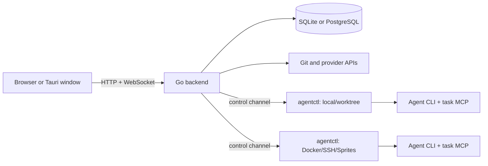

# Architecture

Kandev is a server-first development workbench. A Go backend owns durable product state and orchestration. The browser UI is a Vite-built React SPA. Agent processes run behind an `agentctl` sidecar in local, worktree, container, or remote task environments.

## Processes and launchers

`apps/backend/cmd/kandev/main.go` is the shipped entry point. Normal arguments enter the native launcher in `apps/backend/internal/launcher/`; the hidden `__backend` mode enters the composition root in `apps/backend/internal/backendapp/`.

These adjacent launch layers have different jobs:

- `apps/cli/src/` supplies the TypeScript development supervisor used by `make dev`.
- The published `apps/cli/bin/` npm shim selects the matching `@kdlbs/runtime-*` package and starts its native `kandev` binary.
- `apps/backend/internal/launcher/` implements installed `run`, `start`, and service behavior.
- `apps/desktop/` is a Tauri shell. Rust starts its bundled `kandev --headless` on an owned loopback origin and owns native windows, external links, notifications, and updates. The product UI is still the backend-served SPA.

The root build embeds generated web assets in the Go binary. `make dev` instead starts Vite and configures Go to proxy it, so HTTP, API, and WebSocket traffic still enters through Go.

## Backend ownership

Backend code is under `apps/backend/internal/`. Common owners include:

- `task/`, `workflow/`, `orchestrator/`, and `runs/` for work state and dispatch;
- `agent/` for agent definitions, profiles, executor mapping, and lifecycle;
- `agentctl/` for the sidecar server, process/protocol adapters, Git, files, shell, terminal, and workspace operations;
- `worktree/` plus runtime implementations for local, Docker, remote Docker, SSH, and Sprites environments;
- provider domains such as `github/`, `gitlab/`, `jira/`, `linear/`, `sentry/`, and `slack/`;
- `mcp/` for Kandev tool schemas and backend handlers;
- `gateway/websocket/` for client broadcasts;
- `system/`, `persistence/`, and `db/` for status, storage setup, pools, and SQL dialect primitives.

`internal/backendapp/` constructs these domains and registers routes, subscribers, schedulers, and startup recovery.

Layouts vary by domain. Handlers translate HTTP or WebSocket requests; some domains add controllers; services own behavior; repositories or stores own persistence; providers adapt external systems. Use the nearest established boundary instead of treating this as a mandatory global stack.

## Web ownership and state flow

`apps/web/src/main.tsx` loads the Go boot payload, creates the Zustand state provider, and renders the shell and route dispatcher. Top-level routing lives in `src/spa-routes.tsx`; it is custom SPA routing, not Next.js filesystem routing. Next-shaped `app/**/page.tsx` files are page components.

HTTP clients in `lib/api/domains/` and domain hooks in `hooks/domains/` issue requests. `lib/state/` hydrates and composes store slices. `lib/ws/` routes live updates into that state. The backend remains authoritative; the client must recover from missed, duplicate, or stale events.

See [Web development](web-development.md) for settings and workbench ownership.

## Task runtime and agentctl

A task selects repositories, an agent profile, and an executor profile. Product executor types are `local`, `worktree`, `local_docker`, `remote_docker`, `sprites`, `ssh`, and test-only `mock_remote`. They map to lifecycle backends `standalone`, `docker`, `remote_docker`, `sprites`, or `ssh`; local and worktree share a process backend but prepare different Git environments.

`internal/agent/runtime/` is the intended high-level backend lifecycle facade, but it remains transitional and current callers also use `internal/agent/runtime/lifecycle/` directly. Backend-side clients in `internal/agent/runtime/agentctl/` reach the agentctl server implemented in `internal/agentctl/server/`.

Local and worktree execution share a host agentctl control server that manages multiple task instances. Container and remote backends deliver or start agentctl in the target environment. Its authenticated control and per-instance APIs own the agent subprocess, ACP adapter, workspace, Git, file, process, shell, terminal, port, and MCP relay operations. The backend, not the browser, coordinates that channel.

A worktree isolates concurrent Git state. It does not isolate processes, the host filesystem, or credentials. Containers and remote hosts add stronger runtime boundaries, but every credential explicitly delivered to an environment remains available there.

## ACP, REST, and MCP

These protocols are separate:

- **ACP** is the structured agent-session protocol. The current agentctl adapter factory accepts ACP.
- **REST and WebSocket** are backend/client and agentctl control surfaces.
- **MCP** supplies Kandev and profile-configured tools to an agent. It is not an agent runtime adapter.

agentctl hosts task MCP endpoints and relays tool calls over the agent stream to backend handlers. The backend also exposes external MCP routes. Kandev currently adds no user-auth middleware to those external routes; do not expose them on an untrusted network without binding, proxy authentication, and scoped credentials. See [Automation and MCP](automation-and-mcp.md).

## Events and persistence

The event bus provides live fan-out to WebSocket broadcasters and backend subscribers. It uses an in-memory bus by default and can use NATS when configured. It is not durable replay: persist a transition before publishing, make consumers tolerate duplicates and reconnects, and recover from the database.

SQLite is the default database; PostgreSQL is supported. There is no central migration-file framework. Domain repositories/stores initialize fresh schemas and apply ordered, inline upgrades at startup. `internal/persistence/` opens the database, maintains boot metadata, and records the current binary version after repository initialization succeeds; `internal/db/` provides pools, rebinding, and dialect helpers.

Keep long-running provider or agent work outside transactions. Persist stable IDs and explicit statuses so startup recovery can reconcile partial execution. See [Backend development](backend-development.md) for migration rules.

## Trust boundaries

Review each crossing explicitly:

- browser or desktop window to backend;
- backend to provider APIs and Git remotes;
- backend to agentctl and a task environment;
- agentctl to the selected agent and MCP servers;
- host to Docker, SSH, Sprites, or other remote infrastructure.

Validate scope and identity server-side. Treat provider text, repository content, agent output, URLs, archives, paths, and command arguments as untrusted. Never rely on a frontend-only permission check.

`apps/backend/internal/office/` contains feature-flagged, in-progress autonomy work. Its source tree is not a supported extension API for the regular task product.
