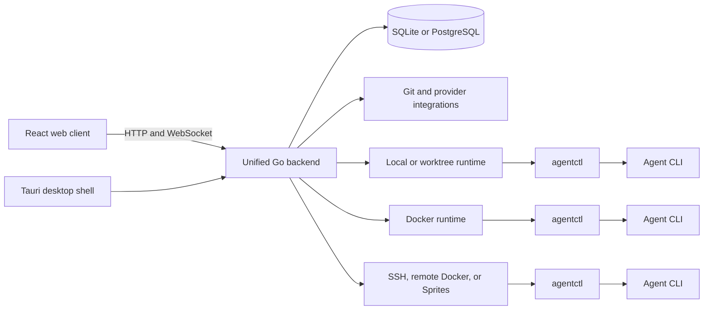

# Architecture

Kandev is a server-first development workbench. A unified Go binary owns orchestration and persistent state, serves the Vite-built React application, and manages local or remote task environments through agentctl.

## Process entry points

`apps/backend/cmd/kandev/main.go` dispatches between the public launcher and the hidden `__backend` mode. `apps/backend/internal/launcher/` starts the installed runtime and browser. `apps/backend/internal/backendapp/` wires the production server.

At startup the backend loads configuration, creates logging and the event bus, opens persistence, constructs domain services, registers HTTP/WebSocket/MCP routes, starts schedulers and watchers, and flips readiness only after the listener and routes are ready.

The release binary embeds the built web assets. Development runs Vite separately and the backend proxies web traffic while retaining API and WebSocket ownership.

## Backend domains

Backend code is organized by domain under `apps/backend/internal/`:

- `task/`, `workflow/`, `orchestrator/`, and `runs/` own work state and dispatch;
- `agent/` and `agentctl/` own agent discovery, profiles, protocol adapters, process control, terminals, Git, and runtime communication;
- `worktree/`, `ssh/`, `sprites/`, and `agent/docker/` materialize executor environments;
- `github/`, `gitlab/`, `jira/`, `linear/`, `sentry/`, and `slack/` own provider adapters;
- `mcp/` exposes task/config coordination tools;
- `system/` owns status, database, backups, logs, disk, updates, and build information;
- `gateway/websocket/` broadcasts state changes to connected clients;
- `db/` and domain repositories provide SQLite/PostgreSQL persistence.

Handlers translate HTTP or WebSocket messages. Services enforce domain behavior. Repositories own persistence. Keep provider SDK shapes and transport DTOs out of the core model where an existing adapter boundary exists.

## Web client

`apps/web/` is a React 19 application built with Vite. The backend serves its production output as a single-page application. Client routing, initial bootstrap data, HTTP domain clients, a WebSocket connection, and Zustand state keep the UI synchronized with backend state.

Page-level code lives under `apps/web/app/`; reusable UI and feature components live under `apps/web/components/`; API, routing, state, and shared utilities live under `apps/web/lib/`. Tests are colocated or under `apps/web/e2e/` depending on scope.

The web application should display backend truth rather than reimplement workflow or lifecycle rules in components.

## Task execution

A task selects one or more repositories, an agent profile, and an executor profile. The executor materializes a task environment. The backend launches or reaches agentctl in that environment; agentctl then runs the agent CLI and exposes process, shell, Git, file, terminal, ACP, and task-MCP capabilities through its control channel.

The task environment can outlive one agent turn and can be shared by several sessions. A worktree separates Git files/branches, while a container or remote host establishes a stronger runtime boundary. None of them automatically narrow the credentials explicitly provided to the agent.

## Events and real-time state

The backend event bus decouples state changes from WebSocket broadcasts, workflow reactions, integration watches, and schedulers. Unified mode uses an in-memory bus; deployments can configure NATS where supported.

Persist the durable transition before publishing an event. Consumers must tolerate retries, reconnects, and stale clients. The UI refetches authoritative state when an incremental event is insufficient.

## Persistence

SQLite is the default. PostgreSQL support is selected through configuration. Domain repositories own schema and queries; dialect helpers isolate SQL differences.

Do not put long-running network or agent work inside database transactions. Use explicit statuses and durable IDs so startup recovery, watchers, and queued work can reconcile partial execution.

## Trust boundaries

Important boundaries are:

- browser/desktop client to backend;
- backend to provider APIs and Git remotes;
- backend to agentctl task environments;
- agentctl to the selected agent process and MCP servers;
- host to Docker/SSH/Sprites infrastructure.

Worktrees are concurrency isolation, not OS security. External MCP currently has no Kandev user-auth boundary. Remote deployments must use network access controls and scoped credentials. See [Automation and MCP](automation-and-mcp.md) and [Operations](operations.md).

## Office source tree

`apps/backend/internal/office/` contains feature-flagged, in-progress autonomy work. Its source packages are not a supported extension API for the regular task product. Keep public behavior and status explicit when touching it.
