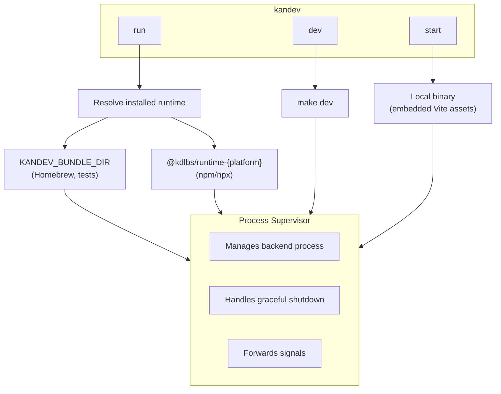

# Kandev CLI

## Architecture



## Overview

The Kandev CLI (`kandev`) is the primary way to run the Kandev application. It launches the backend from an installed runtime bundle; the backend serves the web assets, API, and WebSocket gateway.

## Installation

### Homebrew (macOS, Linux)

```bash
brew install kdlbs/kandev/kandev
```

### NPX (requires npm 7+)

```bash
npx kandev@latest
```

`npx` installs the `kandev` CLI plus the matching `@kdlbs/runtime-{platform}` package via npm optional dependencies. Older npm versions silently skip optional deps and won't work — npm 7 is the floor.

### NPM (global)

```bash
npm install -g kandev@latest
```

## Quick Start

```bash
# Run the installed runtime
kandev

# Opens the app at http://localhost:38429 (or next available port)
```

## Updates

The package manager controls the runtime version:

```bash
brew upgrade kandev                  # Homebrew users
npm install -g kandev@latest         # global npm users
npx kandev@latest                    # npx users (always latest)
```

## Commands

### `kandev` / `kandev run`

Runs the installed runtime bundle. This is the default command.

```bash
kandev
kandev run
```

**What happens:**
1. Resolves the runtime bundle (KANDEV_BUNDLE_DIR → npm package).
2. Starts the backend server.
3. Waits for backend health check.
4. Serves the embedded web UI from the backend.
5. Opens browser when ready.

### `kandev start`

Runs the application using the local production backend binary. Requires running
`make build` first so the Vite SPA is embedded into that binary.

```bash
make build
kandev start
```

## Options

| Option | Description | Example |
|--------|-------------|---------|
| `--version`, `-V` | Print CLI version and exit | `kandev --version` |
| `--port <port>` | Backend port (alias: `--backend-port`) | `--port 3000` |
| `--verbose`, `-v` | Show info logs from backend | `--verbose` |
| `--debug` | Show debug logs + agent message dumps | `--debug` |
| `--help`, `-h` | Show help | `--help` |

### Examples

```bash
# Print CLI version
kandev --version

# Custom port
kandev --port 18080

```

## Port Selection

By default, the CLI automatically finds available ports:

| Service | Default Port | Fallback |
|---------|--------------|----------|
| Backend | 38429 | Auto-selects from 10000–60000 |
| Web | 37429 | Auto-selects from 10000–60000 |
| AgentCtl | 39429 | Auto-selects from 10000–60000 |

If the default port is in use, the CLI finds the next available port automatically.

## Environment Variables

| Variable | Description |
|----------|-------------|
| `KANDEV_BUNDLE_DIR` | Force the runtime bundle location (set by Homebrew wrapper) |
| `KANDEV_PORT` / `KANDEV_BACKEND_PORT` | Backend port (CLI flag wins) |
| `KANDEV_WEB_PORT` | Internal web app port |
| `KANDEV_HEALTH_TIMEOUT_MS` | Override health check timeout (ms) |

## Makefile Integration

The repo includes a Makefile that wraps the CLI for common operations:

```bash
make start    # Production mode (after make build)
make dev      # Development mode
make build    # Build everything
```

See `make help` for all available commands.

## Comparison: run vs dev vs start

| Feature | `run` | `dev` | `start` |
|---------|-------|-------|---------|
| Source | Installed runtime | Local repo | Local build |
| Hot-reload | No | Yes | No |
| Requires repo | No | Yes | Yes |
| Requires build | No | No | Yes |
| Use case | End users | Development | Testing production |

## Troubleshooting

### "No Kandev runtime found for {platform}"

The CLI couldn't find an installed runtime. Install one:

```bash
# via npm (requires npm 7+ for optional dep resolution)
npx kandev@latest
# via Homebrew
brew install kdlbs/kandev/kandev
```

If you're on npm 6 or older, optional dependencies aren't installed by `npx`. Upgrade npm: `npm install -g npm@latest`.

### Port Already in Use

The CLI automatically finds available ports. If you need a specific port:

```bash
kandev --port 18080
```

### Backend Takes Too Long to Start

Increase the health check timeout:

```bash
KANDEV_HEALTH_TIMEOUT_MS=60000 kandev
```

### Start Mode: "Backend binary not found"

Build the project first:

```bash
make build
kandev start
```

## Data Storage

| Path | Contents |
|------|----------|
| `~/.kandev/data/` | SQLite database and app data |
| Homebrew Cellar | Installed runtime (when installed via brew) |
| Under the global package root printed by `npm root -g` | Installed runtime dependency tree for `npm install -g kandev` |
| `<npm cache>/_npx/<run-id>/node_modules/` | Temporary package tree, including the platform runtime, for `npx kandev` |

Run `npm config get cache` to print `<npm cache>`. npm chooses the `_npx`
run-directory name and may remove cached runs, so do not treat that path as
persistent application data.
