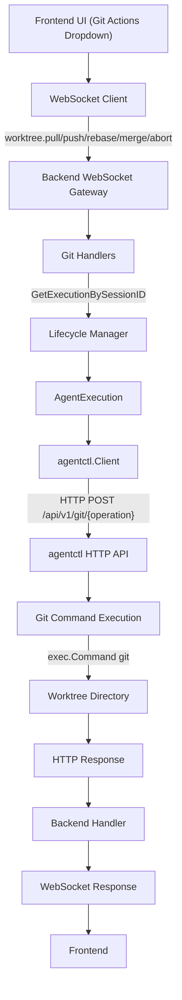
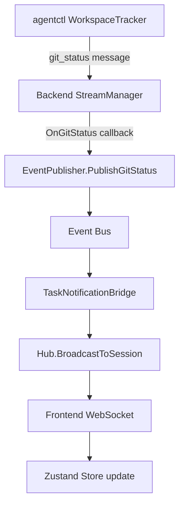

# Git Operations for Worktrees

This document describes the architecture for Git operations (Pull, Push, Rebase, Merge, and Abort) on worktrees in Kandev.

## Overview

Git operations are executed **in agentctl**, not in the backend. This ensures consistent behavior whether running locally or in Docker/remote environments. The backend acts as a proxy, forwarding requests from the frontend WebSocket to agentctl's HTTP API.

## Supported Operations

| Operation | Direction | Description |
|-----------|-----------|-------------|
| **Pull** | Remote → Worktree | Fetch and merge changes from remote for the worktree's branch |
| **Push** | Worktree → Remote | Push local commits to remote |
| **Rebase** | Base → Worktree | Rebase worktree branch onto base branch (rewrites history) |
| **Merge** | Base → Worktree | Merge base branch into worktree branch (creates merge commit) |
| **Abort** | - | Abort an in-progress merge or rebase |

## Architecture

### Request Flow



### Notification Flow (Git Status Updates)

After any git operation, the workspace state changes. Updates flow through the event bus:



## agentctl API

### Endpoints

| Method | Path | Description |
|--------|------|-------------|
| POST | `/api/v1/git/pull` | Pull from remote |
| POST | `/api/v1/git/push` | Push to remote |
| POST | `/api/v1/git/rebase` | Rebase onto base branch |
| POST | `/api/v1/git/merge` | Merge base branch in |
| POST | `/api/v1/git/abort` | Abort merge/rebase |

### Request/Response Format

**Pull Request:**
```json
{ "rebase": false }
```

**Push Request:**
```json
{ "force": false, "set_upstream": true }
```

**Rebase/Merge Request:**
```json
{ "base_branch": "main" }
```

**Abort Request:**
```json
{ "operation": "merge" }
```

Every request also accepts an optional `repo` subpath for multi-repository task workspaces. Omit it for a single-repository workspace.

**Response (all operations):**
```json
{
  "success": true,
  "operation": "pull",
  "output": "Already up to date.",
  "error": null,
  "conflict_files": []
}
```

## Locking

A per-instance mutex in agentctl prevents concurrent git operations on the same worktree. If an operation is already running, new requests return HTTP 409 Conflict.

## Conflict Handling

- **Rebase conflicts**: Automatically aborted (`git rebase --abort`), conflict files returned
- **Merge conflicts**: Left in place for user/agent resolution, conflict files returned
- **Abort endpoint**: Allows manual abort of conflicted merge/rebase

## Frontend Integration

### WebSocket Actions

- `worktree.pull` - Pull from remote
- `worktree.push` - Push to remote
- `worktree.rebase` - Rebase onto base
- `worktree.merge` - Merge base branch
- `worktree.abort` - Abort operation

### Hook Usage

```typescript
const { pull, push, rebase, merge, abort, isLoading, error } = useGitOperations(sessionId);

// In component
<Button onClick={() => pull()} disabled={isLoading}>Pull</Button>
<Button onClick={() => rebase("main")} disabled={isLoading}>Rebase</Button>
<Button onClick={() => merge("main")} disabled={isLoading}>Merge</Button>
<Button onClick={() => abort("rebase")} disabled={isLoading}>Abort rebase</Button>
```

`rebase` and `merge` require the base branch as their first argument. In a
multi-repository workspace, pass the repository subpath as the optional second
argument, for example `rebase("main", "kandev")`.

## Files

### agentctl

- `server/api/git.go` - HTTP handlers
- `server/process/git.go` - Git command execution
- `client/git.go` - Client methods

### Backend

- `internal/agent/handlers/git_handlers.go` - WebSocket handlers
- `pkg/websocket/actions.go` - Action constants

### Frontend

- `lib/types/backend.ts` - TypeScript types
- `hooks/use-git-operations.ts` - WebSocket action functions and React hook
