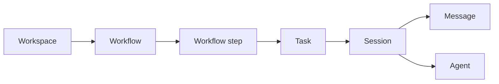

# Kandev WebSocket API

This page documents the WebSocket envelope, current domain model, and the request actions used by the main task and agent workflow. It is not a substitute for the Go request types: payloads evolve with the application.

## Scope and source of truth

Kandev uses one persistent WebSocket connection for browser request/response traffic and real-time notifications. This applies to WebSocket-backed operations only; Kandev also has dedicated HTTP APIs. For example, workflow import and export use HTTP routes because they transfer portable documents.

Use these sources when checking an action:

- [`apps/backend/pkg/websocket/actions.go`](../../apps/backend/pkg/websocket/actions.go) defines action names and error codes.
- Registered handlers such as [`task_handlers.go`](../../apps/backend/internal/task/handlers/task_handlers.go) and [`handlers.go`](../../apps/backend/internal/orchestrator/handlers/handlers.go) define which action constants accept client requests and their payload contracts.
- [`apps/backend/pkg/websocket/message.go`](../../apps/backend/pkg/websocket/message.go) defines the message envelope.

An action constant by itself does not guarantee a request handler. Some constants are server-to-client notifications only.

**Local endpoint:** `ws://localhost:38429/ws`

Use `wss://` when Kandev is served over HTTPS.

## Message envelope

### Request

```json
{
  "id": "550e8400-e29b-41d4-a716-446655440000",
  "type": "request",
  "action": "workflow.list",
  "payload": {
    "workspace_id": "workspace-uuid"
  },
  "timestamp": "2026-07-15T09:00:00Z"
}
```

### Response

```json
{
  "id": "550e8400-e29b-41d4-a716-446655440000",
  "type": "response",
  "action": "workflow.list",
  "payload": {
    "workflows": [],
    "total": 0
  },
  "timestamp": "2026-07-15T09:00:00Z"
}
```

### Notification

```json
{
  "type": "notification",
  "action": "task.updated",
  "payload": {
    "id": "task-uuid",
    "title": "Update authentication"
  },
  "timestamp": "2026-07-15T09:00:01Z"
}
```

### Error

```json
{
  "id": "550e8400-e29b-41d4-a716-446655440000",
  "type": "error",
  "action": "task.get",
  "payload": {
    "code": "NOT_FOUND",
    "message": "Task not found"
  },
  "timestamp": "2026-07-15T09:00:01Z"
}
```

| Field | Type | Contract |
|-------|------|----------|
| `id` | string | Correlates a request with its response or error. Notifications omit it. |
| `type` | string | `request`, `response`, `notification`, or `error`. |
| `action` | string | Registered action name. |
| `payload` | object | Action-specific request or response data. |
| `timestamp` | string | ISO 8601 timestamp. Server responses, notifications, and errors always include it. Client requests may omit it; the backend does not use it for request correlation. |
| `metadata` | object | Optional string-to-string metadata used by selected internal flows. |

Error codes currently include `BAD_REQUEST`, `NOT_FOUND`, `INTERNAL_ERROR`, `UNAUTHORIZED`, `FORBIDDEN`, `VALIDATION_ERROR`, `CONFLICT`, and `UNKNOWN_ACTION`.

## Current domain model



The common request flow is:

1. List or create a workspace.
2. List or create a workflow in that workspace.
3. List the workflow steps.
4. Create a task with `workspace_id`, `workflow_id`, and `workflow_step_id`.
5. Subscribe to the task and session for live updates.
6. Start work with `session.launch`.
7. Send user turns with `message.add`, or use `message.queue.*` while a turn is active.
8. Stop a session with `session.stop`, or update the task with `task.state`.

## Registered request actions

The tables below cover the core task workflow. Check `actions.go` and handler registration for integrations and less common operational actions.

### Workspaces and workflows

| Action | Purpose |
|--------|---------|
| `workspace.list` | List workspaces. |
| `workspace.create` | Create a workspace. |
| `workspace.get` | Get a workspace by ID. |
| `workspace.update` | Update a workspace. |
| `workspace.delete` | Delete a workspace. |
| `workflow.list` | List workflows, optionally scoped by `workspace_id`. |
| `workflow.create` | Create a workflow in a workspace. |
| `workflow.get` | Get a workflow by ID. |
| `workflow.update` | Update a workflow. |
| `workflow.delete` | Delete a workflow. |
| `workflow.reorder` | Reorder workflows in a workspace. |
| `workflow.template.list` | List workflow templates. |
| `workflow.template.get` | Get a workflow template. |
| `workflow.step.list` | List steps for a workflow. |
| `workflow.step.get` | Get a workflow step. |
| `workflow.step.create` | Create a workflow's steps from a template. |
| `workflow.history.list` | List workflow history for a session. |

Direct create, update, delete, and reorder operations for individual workflow steps are exposed through the HTTP workflow API and configuration-mode MCP tools. They are not registered as ordinary WebSocket requests.

### Tasks

| Action | Purpose |
|--------|---------|
| `task.list` | List tasks for a workflow. |
| `task.create` | Create a task. |
| `task.get` | Get a task. |
| `task.update` | Update task fields. |
| `task.repository.update` | Update a task repository's base branch. |
| `task.delete` | Delete a task. |
| `task.move` | Move a task to a workflow step. |
| `task.state` | Set the task state. |
| `task.archive` | Archive or unarchive a task. |
| `task.session.list` | List sessions for a task. |
| `task.session.status` | Get task session status. |
| `task.plan.create` | Create a task plan. |
| `task.plan.get` | Get a task plan. |
| `task.plan.update` | Update a task plan. |
| `task.plan.delete` | Delete a task plan. |
| `task.plan.revisions.list` | List plan revisions. |
| `task.plan.revision.get` | Get a plan revision. |
| `task.plan.revert` | Revert a plan revision. |

### Sessions, messages, and agents

| Action | Purpose |
|--------|---------|
| `session.launch` | Unified prepare, start, resume, workflow-step, or workspace-restore operation. |
| `session.ensure` | Return an existing task session or create one. |
| `session.recover` | Resume, fresh-start, or cancel a transient retry. |
| `session.reset_context` | Reset an agent session's context. |
| `session.stop` | Stop a session. |
| `session.delete` | Delete a session. |
| `session.set_primary` | Set the primary session for a task. |
| `session.set_plan_mode` | Enable or disable plan mode. |
| `message.add` | Persist a user message and forward it to the session when appropriate. |
| `message.list` | List session messages. |
| `message.search` | Search messages. |
| `message.queue.add` | Queue a message for a busy session. |
| `message.queue.get` | Read queued messages and status. |
| `message.queue.update` | Replace queued message content. |
| `message.queue.append` | Append content to a queued message. |
| `message.queue.drain` | Dispatch one queued entry when the session can accept it. |
| `message.queue.remove` | Remove one queued entry. |
| `message.queue.cancel` | Clear the session queue. |
| `agent.list` | List agent executions. |
| `agent.launch` | Low-level agent launch. Prefer `session.launch` for task sessions. |
| `agent.status` | Get agent status. |
| `agent.logs` | Get agent logs. |
| `agent.stop` | Stop an agent execution. |
| `agent.cancel` | Cancel the active agent turn. |
| `agent.types` | List available agent types. |

Agent and task-session lifecycle states are uppercase on the wire. For example,
agent states include `PENDING`, `STARTING`, `RUNNING`, `READY`, `COMPLETED`,
`FAILED`, and `STOPPED`.

### Orchestrator and subscriptions

Only these orchestrator request actions are registered:

| Action | Purpose |
|--------|---------|
| `orchestrator.status` | Get orchestrator status. |
| `orchestrator.queue` | Get queued tasks. |
| `orchestrator.stop` | Stop execution for a task. |

Lifecycle starts and user turns use `session.launch` and `message.add`; task completion uses `task.state` or workflow automation.

Subscription requests are handled by the WebSocket gateway:

| Action | Payload key |
|--------|-------------|
| `task.subscribe` / `task.unsubscribe` | `task_id` |
| `session.subscribe` / `session.unsubscribe` | `session_id` |
| `session.focus` / `session.unfocus` | `session_id` |
| `user.subscribe` / `user.unsubscribe` | user-scoped connection state |
| `run.subscribe` / `run.unsubscribe` | `run_id` |
| `system.metrics.subscribe` / `system.metrics.unsubscribe` | no resource ID |

## Core payload examples

### List workflow steps

```json
{
  "id": "request-steps",
  "type": "request",
  "action": "workflow.step.list",
  "payload": {
    "workflow_id": "workflow-uuid"
  },
  "timestamp": "2026-07-15T09:01:00Z"
}
```

### Create a task

`workspace_id`, `workflow_id`, and `title` are required. `workflow_step_id` selects the initial step and should be supplied by normal clients.

```json
{
  "id": "request-create-task",
  "type": "request",
  "action": "task.create",
  "payload": {
    "workspace_id": "workspace-uuid",
    "workflow_id": "workflow-uuid",
    "workflow_step_id": "step-uuid",
    "title": "Implement feature X",
    "description": "Detailed requirements",
    "priority": "high",
    "repositories": [
      {
        "repository_id": "repository-uuid",
        "base_branch": "main"
      }
    ]
  },
  "timestamp": "2026-07-15T09:02:00Z"
}
```

To create and immediately start a task, also send `start_agent: true` and a valid `agent_profile_id`. The response then includes `session_id` and `agent_execution_id` when launch succeeds.

### Move a task

```json
{
  "id": "request-move-task",
  "type": "request",
  "action": "task.move",
  "payload": {
    "id": "task-uuid",
    "workflow_id": "workflow-uuid",
    "workflow_step_id": "target-step-uuid",
    "position": 0
  },
  "timestamp": "2026-07-15T09:03:00Z"
}
```

### Launch a session

`session.launch` accepts these intents: `prepare`, `start`, `start_created`, `resume`, `workflow_step`, and `restore_workspace`. If `intent` is omitted, the backend infers it from the other fields.

```json
{
  "id": "request-launch-session",
  "type": "request",
  "action": "session.launch",
  "payload": {
    "task_id": "task-uuid",
    "intent": "start",
    "agent_profile_id": "profile-uuid",
    "prompt": "Implement the task and run focused tests"
  },
  "timestamp": "2026-07-15T09:04:00Z"
}
```

```json
{
  "id": "request-launch-session",
  "type": "response",
  "action": "session.launch",
  "payload": {
    "success": true,
    "task_id": "task-uuid",
    "session_id": "session-uuid",
    "agent_execution_id": "execution-uuid",
    "state": "RUNNING"
  },
  "timestamp": "2026-07-15T09:04:01Z"
}
```

### Send a user turn

```json
{
  "id": "request-add-message",
  "type": "request",
  "action": "message.add",
  "payload": {
    "task_id": "task-uuid",
    "session_id": "session-uuid",
    "content": "Also add regression coverage"
  },
  "timestamp": "2026-07-15T09:05:00Z"
}
```

### Mark a task complete

```json
{
  "id": "request-complete-task",
  "type": "request",
  "action": "task.state",
  "payload": {
    "id": "task-uuid",
    "state": "COMPLETED"
  },
  "timestamp": "2026-07-15T09:06:00Z"
}
```

## Notifications

Common server notifications include:

- Task lifecycle: `task.created`, `task.updated`, `task.deleted`, `task.state_changed`.
- Workflow lifecycle: `workflow.created`, `workflow.updated`, `workflow.deleted`, `workflow.step.created`, `workflow.step.updated`, `workflow.step.deleted`.
- Session messages and state: `session.message.added`, `session.message.updated`, `session.message.deleted`, `session.state_changed`, `session.waiting_for_input`, `session.turn.started`, `session.turn.completed`.
- Agent stream compatibility events: `acp.progress`, `acp.log`, `acp.result`, `acp.error`, `acp.status`, `acp.heartbeat`.
- Permission flow: `permission.requested`; clients answer with `permission.respond`. Its payload requires `session_id` and `pending_id`, plus `option_id` unless `cancelled` is `true`. The optional `rejected` flag distinguishes an explicit denial from dismissing the request.
- Repository and executor lifecycle events matching the `*.created`, `*.updated`, and `*.deleted` action constants.

Subscribe to the relevant task and session before depending on resource-scoped notifications.

## Browser request helper

```typescript
type PendingRequest = {
  resolve: (message: unknown) => void;
  reject: (error: Error) => void;
};

const pending = new Map<string, PendingRequest>();
const socket = new WebSocket('ws://localhost:38429/ws');

socket.addEventListener('message', (event) => {
  const message = JSON.parse(event.data);
  const request = message.id ? pending.get(message.id) : undefined;
  if (request) {
    pending.delete(message.id);
    request.resolve(message);
  }
});

function rejectPending(reason: string) {
  const error = new Error(reason);
  for (const request of pending.values()) request.reject(error);
  pending.clear();
}

socket.addEventListener('close', () => rejectPending('WebSocket closed'));
socket.addEventListener('error', () => rejectPending('WebSocket failed'));

async function waitForSocketOpen() {
  if (socket.readyState === WebSocket.OPEN) return;
  if (socket.readyState !== WebSocket.CONNECTING) {
    throw new Error('WebSocket is not open');
  }

  await new Promise<void>((resolve, reject) => {
    const cleanup = () => {
      socket.removeEventListener('open', handleOpen);
      socket.removeEventListener('error', handleError);
      socket.removeEventListener('close', handleClose);
    };
    const handleOpen = () => {
      cleanup();
      resolve();
    };
    const handleError = () => {
      cleanup();
      reject(new Error('WebSocket failed to open'));
    };
    const handleClose = () => {
      cleanup();
      reject(new Error('WebSocket closed before opening'));
    };

    socket.addEventListener('open', handleOpen);
    socket.addEventListener('error', handleError);
    socket.addEventListener('close', handleClose);
  });
}

async function request(action: string, payload: Record<string, unknown>) {
  await waitForSocketOpen();

  const id = crypto.randomUUID();
  return new Promise((resolve, reject) => {
    pending.set(id, { resolve, reject });

    try {
      socket.send(JSON.stringify({
        id,
        type: 'request',
        action,
        payload,
        timestamp: new Date().toISOString(),
      }));
    } catch (error) {
      pending.delete(id);
      reject(error instanceof Error ? error : new Error('WebSocket send failed'));
    }
  });
}

await request('task.subscribe', { task_id: 'task-uuid' });
const launch = await request('session.launch', {
  task_id: 'task-uuid',
  intent: 'start',
  agent_profile_id: 'profile-uuid',
  prompt: 'Implement the task',
});
```

Production clients should also enforce request timeouts and route `type: "error"` responses into typed errors.

## HTTP operations that remain separate

Workflow document transfer is intentionally HTTP-based:

| Method | Route | Purpose |
|--------|-------|---------|
| `GET` | `/api/v1/workflows/:id/export` | Export one workflow. |
| `GET` | `/api/v1/workspaces/:id/workflows/export` | Export workflows from a workspace. |
| `POST` | `/api/v1/workspaces/:id/workflows/import` | Import a portable workflow document. |

Other focused HTTP routes also exist for snapshots, file transfer, health checks, and agentctl-local control APIs. Do not infer that a WebSocket action replaces every HTTP endpoint.
